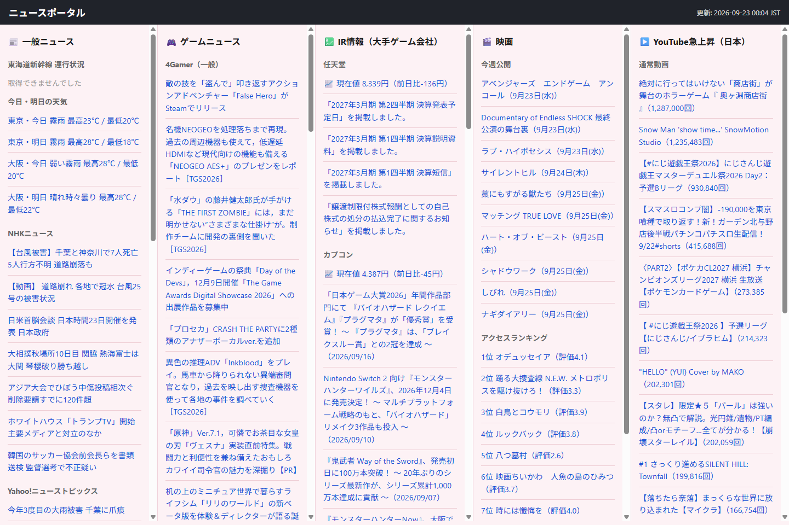

# news-portal

毎時03分、世界が静かに更新される。
ニュース、ゲーム、映画、株価——気になるすべてを、ひとつの画面に。

**→ [https://toshiaki1973.github.io/news-portal/](https://toshiaki1973.github.io/news-portal/)**

## これは何か

タブを増やさず、スクロールするだけで一日の気になることが把握できる、個人用の定点観測ページ。
PCでは5つのカラムを横に並べて同時に眺め、スマホではタブで切り替える。裏側では GitHub Actions が1時間ごとに黙々と最新情報を拾い集め、GitHub Pages に静かに置いていく。

## 見えているもの

- 📰 **一般ニュース** — NHK / Yahoo!ニューストピックス / AI Watch、それに東海道新幹線の運行状況と東京・大阪の天気
- 🎮 **ゲームニュース** — 4Gamer / AUTOMATON、Steamのセール・新作、はちま起稿
- 💹 **IR情報** — 任天堂・カプコン・セガサミーHD・バンダイナムコHD・コナミグループ・スクウェア・エニックスHDの株価と最新開示
- 🎬 **映画** — 今週公開の作品とアクセスランキング
- ▶️ **YouTube急上昇** — 日本のトレンド動画を通常動画とショートに分けて

## つくり

- Python + `requests` のみ（RSS・スクレイピング・各種APIを集約して1枚のHTMLを生成）
- GitHub Actions が毎時03分に `fetch_data.py` を実行し、GitHub Pages へ自動デプロイ
- レイアウトはCSSのみで完結。PCは5カラムグリッドで各カラム独立スクロール、900px未満はタブ切り替えに変わる
